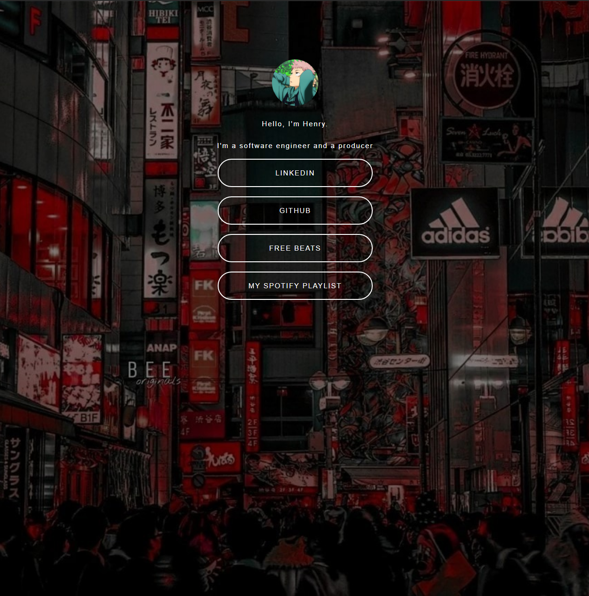

# budgetLinkTree

## Overview

### The challenge

Users should be able to:

- Build a single page website from scratch using very minimal assets to guide the process
- No googling (ironic)

### Screenshot



### Links

- Live Site URL: https://henrysama58.github.io/budgetLinkTree/

## My process

- I just coded from top to bottom on my html and css. I started links, then I styled the links using references from Linktree.
- 
### Built with

- Semantic HTML5 markup
- CSS custom properties
- Flexbox
- CSS Grid

### What I learned

- I learned how to implement CSS properties such as border radius and hover effects. I also learned how to organize my code better.

```css
a {

    text-decoration: none;
    color: white;
    transition: color 1s;
}

a:hover {

    color: #000;
    background: #fff;
}
```

### Continued development

- This is the final version of this project, since it is just a single page website. There was no need for media queries.

### Useful resources

- Linktree.com - This helped me for really seeing what my layout should look like. I used it a lot as reference and I think I will be using references like this in the industry. I really liked this pattern and will use it going forward.

## Author

- Website - [Henry Le] https://henryle.org/
